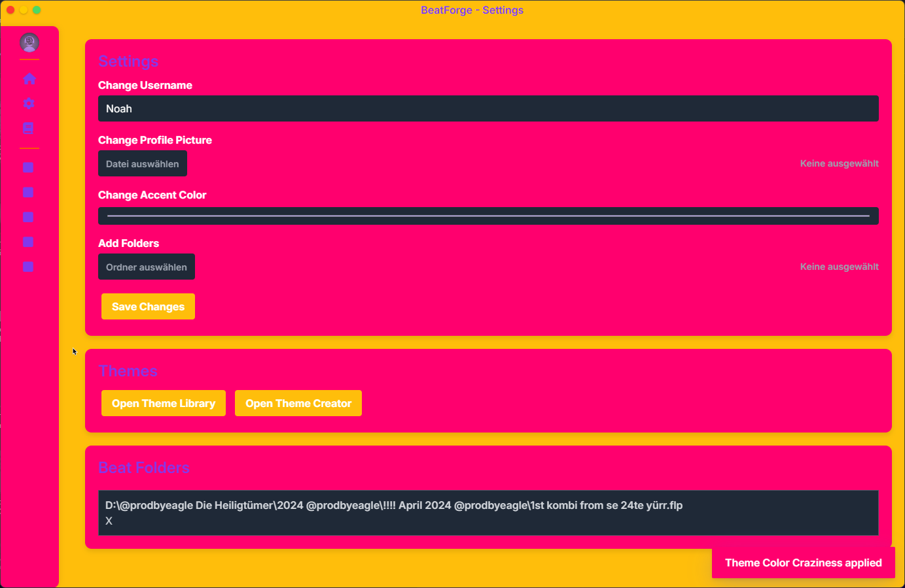
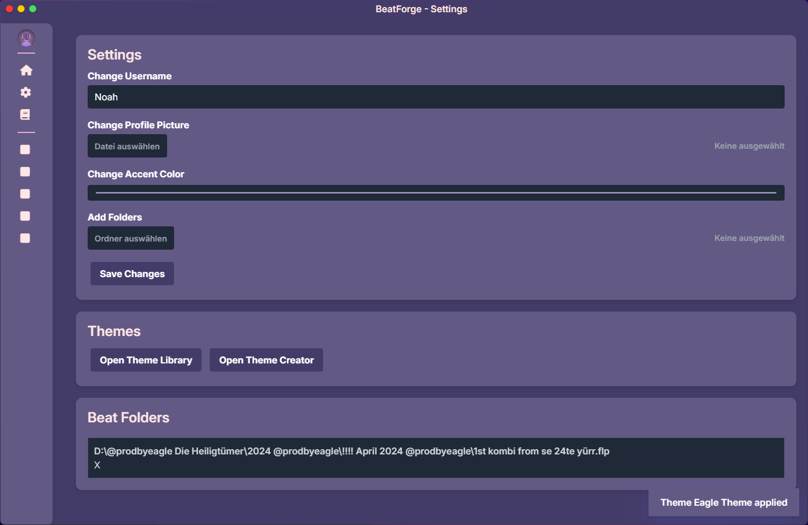
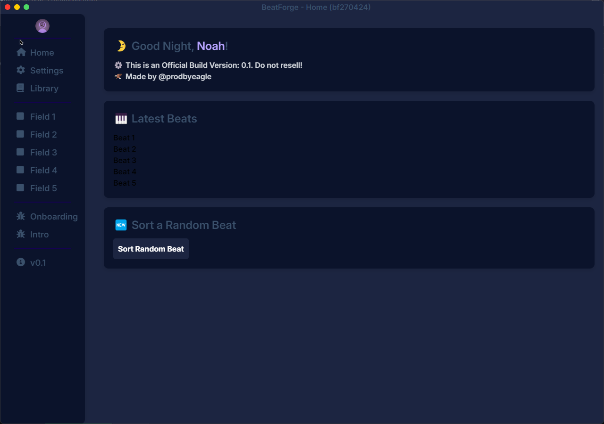
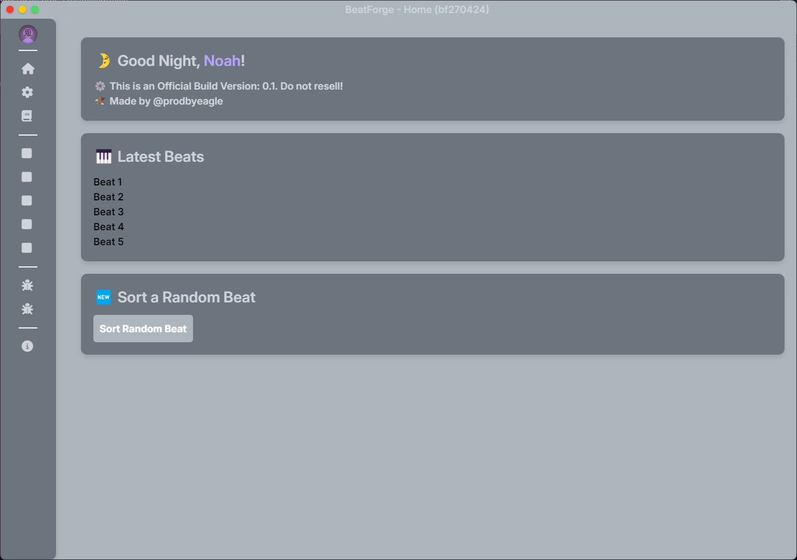
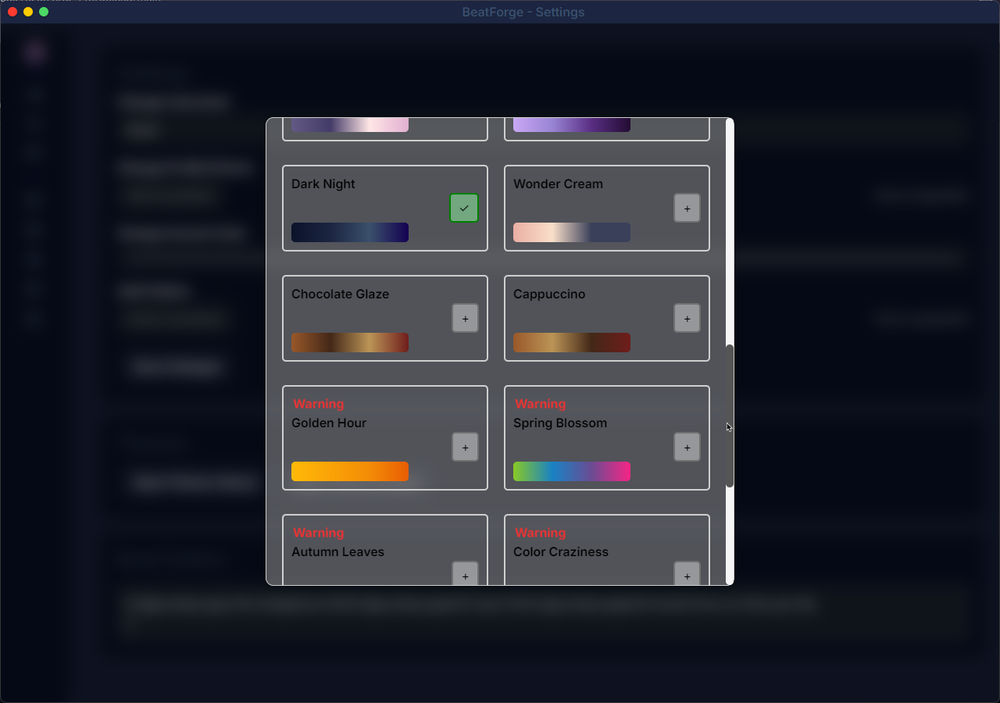

# BeatForge

BeatForge is an advanced app designed for producers who want to better organize their beats, rather than relying on the standard music player or navigating through individual folders.

## Features

- **Custom Tags System**: Users can tag their beats with custom tags for easier categorization and retrieval.
  
- **Onboarding**: A user-friendly onboarding process makes it easy to get started with the app and showcases key features.
  
- **Library with Filters**: The library feature allows users to filter and sort their beats based on various criteria such as length, size, file format, etc.
  
- **Automatic Tag Function** (coming soon): If turned on! The App analyzes each beat in the Background for 5-10 seconds to detect its key and mood (dark, sad, or happy), and adds corresponding tags.
  
- **Theme Browser**: Users can choose from a variety of designs to customize the app according to their preferences.
  
- **Clean Design**: BeatForge features a clean and intuitive design that facilitates easy navigation and management of beats.

## Installation

To install BeatForge, simply download the installer executable file from the [release page](https://github.com/prodbyeagle/BeatForge/releases) and follow the on-screen instructions.

## Feedback

We are actively developing BeatForge and welcome any feedback or suggestions. Please create an issue on the [GitHub repository](https://github.com/prodbyeagle/BeatForge/issues) if you encounter any bugs or have ideas for improvement.

## Contributors

- (@prodbyeagle) - Developer and Founder
- (@you) - Contributer or Theme Creator

## License

BeatForge is currently under development and the license information will be provided once the project reaches a stable release.

---

*Note: Some features marked as "coming soon" may not be implemented yet when you use this app.*

---

